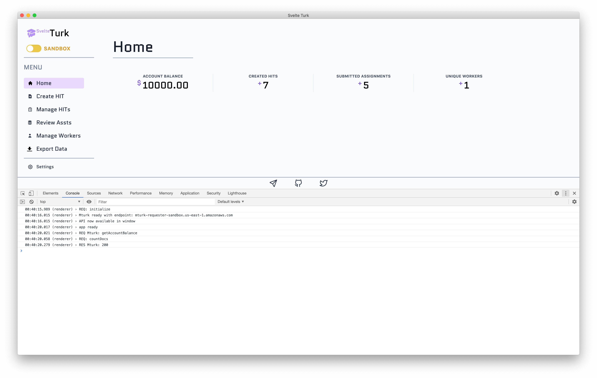
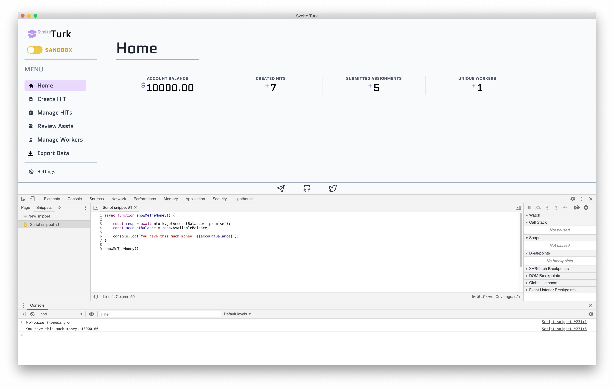
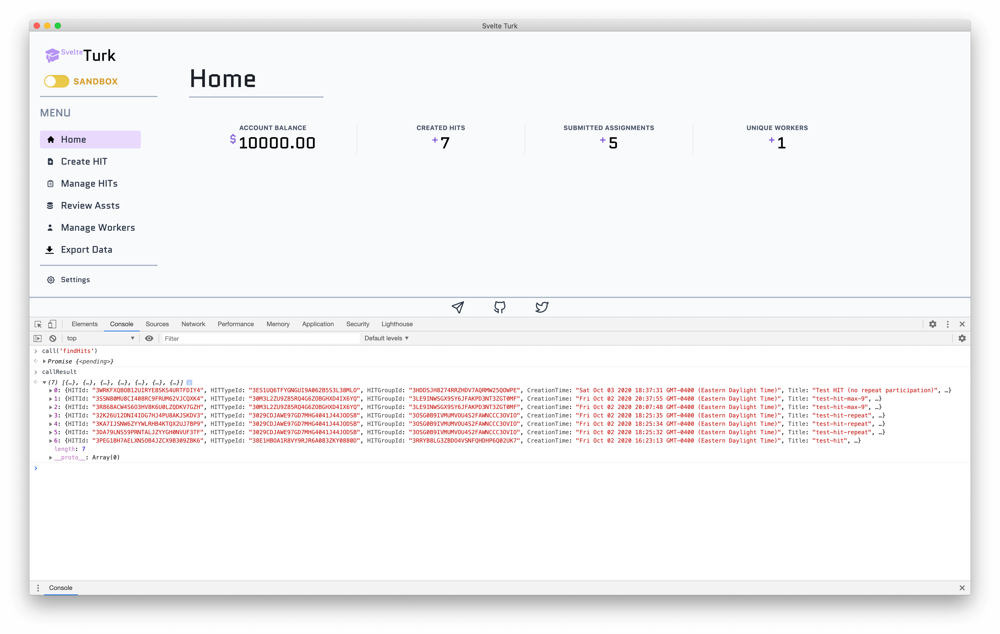

# SvelteTurk API

>[!NOTE]
> As progress on SvelteTurk continues this page will document details about programmatically executing commands in SvelteTurk.

Because SvelteTurk is built on [web technologies](https://www.electronjs.org/), you can access its console using  View > Toggle Developer Tools or by pressing `Cmd+Alt+I`. This will open up the browser console just like in Google Chrome. As SvelteTurk is running, it will print various messages to this console. Sometimes opening it up can help you understand if something isn't quite working right. These messages are also logged to a file in SvelteTurk's [data folder](settings.md#svelte-data-storage). If you do find any issues please open a [bug report!](https://github.com/ejolly/svelteturk/issues/new). This helps improve SvelteTurk for everyone.

## MTurk API

In it's current form SvelteTurk makes the entire [Mturk Javascript API](https://docs.aws.amazon.com/AWSJavaScriptSDK/latest/AWS/MTurk.html) available to you right from this console! This means you can *technically* interact with Mturk almost entirely through code without ever using SvelteTurk's user interface. This can be particularly handy by writing and save [code snippets](https://medium.com/@ishwar.rimal/running-javascript-snippets-with-chrome-dev-tool-94d541b22db3) in this developer console. You can create and save snippets by clicking on the following menu options in the console: Sources > >> Arrow > Snippets. From the left you can create a new snippet and save and run it by pressing `cmd+enter`. The picture below demos asking Mturk for your account balance using the API asynchronously. This is the same thing SvelteTurk is doing behind the scenes!

## Database calls

While currently undocumented ([but available for perusal on github!](https://github.com/ejolly/svelteturk/blob/master/main/main.js)) SvelteTurk offers two convenience functions for making and getting the results of asynchronous calls to its database. These are the `call()` function and `callResult` object. The image below demonstrates querying the database for all HITs.

