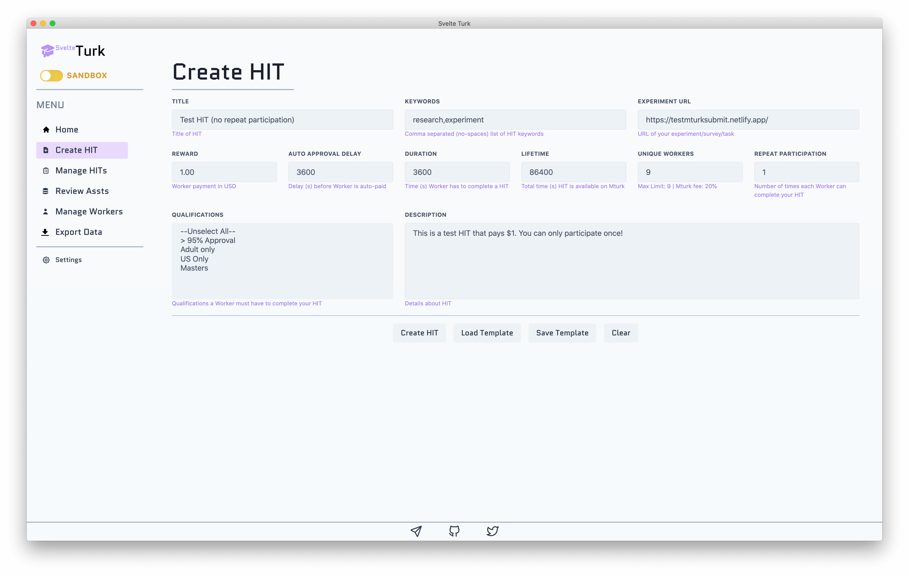
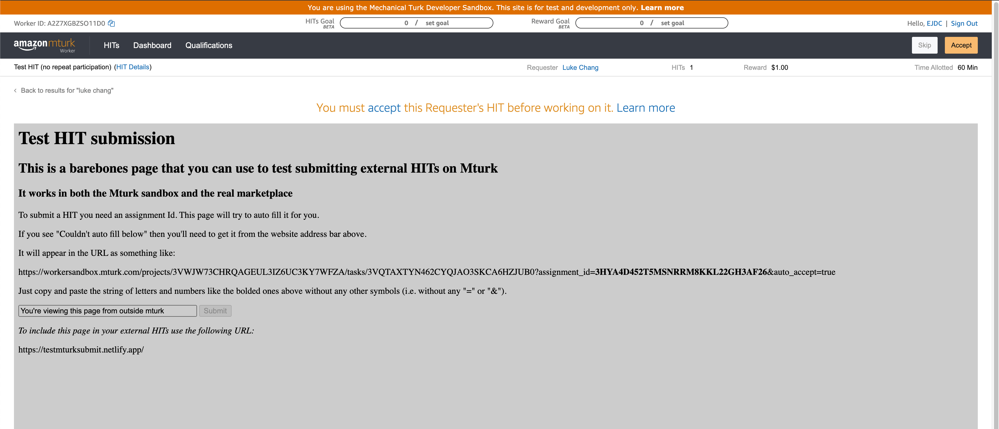
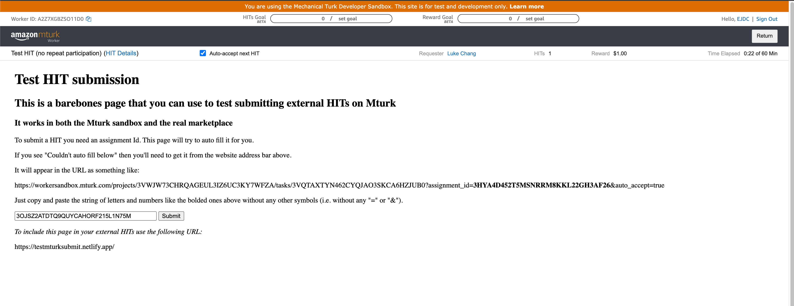
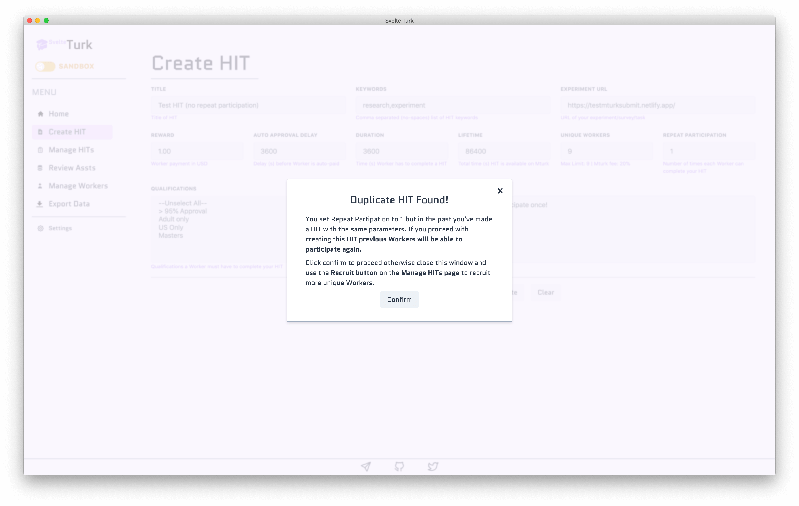

# Creating HITs

SvelteTurk is specifically designed to manage what Mturk calls ["External Question"](https://docs.aws.amazon.com/AWSMechTurk/latest/AWSMturkAPI/ApiReference_ExternalQuestionArticle.html) HITs. These are HITs that primarily use the Mturk platform to direct Workers to perform a task that lives on a different website. Mturk will display this website to Workers inside of a frame embedded in the page (see the [Worker view images below](#what-workers-see)). For this reason, **you  must make sure that your Experiment URL can be [rendered inside an iframe](https://developer.mozilla.org/en-US/docs/Web/HTML/Element/iframe).**

You can create HITs from the Create HIT page. SvelteTurk provides a brief description below each input to help out during HIT creation. At the [bottom of this page](#input-descriptions) you can find a table that provides more detail about each of these inputs. 

> [!NOTE]
> HITs created via Svelte Turk will not show up in your [requestor dashboard](https://requester.mturk.com/) on Amazon's site. This is not a limitation of Svelte Turk, but a general limitation of Mturk itself which does not display HITs created programmatically outside of the requestor dashboard. Instead you should [manage HITs](manage.md) directly from within Svelte Turk or use a SDK library like [Boto (python)](https://boto3.amazonaws.com/v1/documentation/api/latest/index.html) for interacting with the Mturk API.

## What Workers See

Using the exact inputs provided in the image above, below you can see exactly how your create HIT appears to Workers.

### How your task appears in the list of all available HITs

### How your task appears when previewed

### How your task appears when accepted

## Repeat participation and Mturk fees

SvelteTurk tries to simplify the process of HIT creation by allowing you to independently control Unique Workers and Repeat Participation when you create a HIT. It also tries to warn you if a HIT you're about to create will inadvertently allow for repeat participation. There are some notable details to be aware of about these settings, due to limitations imposed by Mturk itself. For more details about Mturk's methodology and terminology see the [Mturk explainer](mturk-basics.md) page or the [Mturk term glossary](_glossary.md). You can also checkout the [suggested usage scenarios](mturk-basics.md#suggested-usage-scenarios) which summarizes much of the information below. 

#### Unique Workers Option

Any HITs created with 9 or fewer Unique Workers are charged a **20% fee** by Amazon. They also **cannot add more that 9 total Unique Workers** at any later point in time (using the [Recruit Button](manage-hits.md) on the Manage HITs page).

Any HITs created with 10 or more Unique Workers are charged a **40% fee** by Amazon, and have **no limit** on the total number of Unique Workers that can be recruited at a later point in time.

#### Repeat Participation Option

Increasing this to any value greater than 1 will **allow a Worker to complete your HIT multiple times**. This can be useful for multi-session tasks or for creating multiple batches of HITs with the same number of Unique Workers if your Experiment URL blocks repeat participation.

> [!TIP]
> If you plan to rely solely on Mturk to prevent repeat Workers, then you should set Repeat Participation to 1. If you want more than 9 Workers to complete your task, you will have to initially create a HIT with **at least 10 Unique Workers,** albeit at a higher Mturk fee. Then, to recruit additional Workers, you should use the [Manage HITs](manage.md) page.  
> 
> Alternatively, if your task website implements its own version of repeat participant blocking, you can save money by setting Unique Workers to 9 (or fewer) and Repeat Participation to more than 2 (or higher). Then, to recruit additional Workers you should create more HITs with the same HIT details (or use a [saved template](#saving-and-loading-templates)). This way at any given time there will be Unique Workers x Repeat Participation tasks Workers can preview and accept. 

## Saving and Loading templates

For convenience, SvelteTurk lets you save and load input form values as HIT Templates. This makes it easy to create new HITs with the same settings as previous ones (**Note:** reusing the exact same settings will automatically open a HIT up to repeat participation. See [here](mturk-basics.md) for an explanation why.). To save a template just press the Save button; only a template with valid input values can be saved, but SvelteTurk will notify you if there are errors prior to saving. To load a template just press the Load button and SvelteTurk will auto-populate the input fields.

## Input descriptions

The table below provides a more detailed description of each input, whether it's required for HIT creation, and if Mturk's terminology differs from SvelteTurk's.

| Name                 | Mturk Name  | Required | Description                                                                                                                                                                                                                                                                                                                                                                                                                                                                                                                                                                           |
| -------------------- | :---------: | -------: | :------------------------------------------------------------------------------------------------------------------------------------------------------------------------------------------------------------------------------------------------------------------------------------------------------------------------------------------------------------------------------------------------------------------------------------------------------------------------------------------------------------------------------------------------------------------------------------ |
| Title                |    same     |      yes | Title of your task as seen by Workers                                                                                                                                                                                                                                                                                                                                                                                                                                                                                                                                                 |
| Keywords             |    same     |       no | Additional descriptors of your task that are searchable by Workers                                                                                                                                                                                                                                                                                                                                                                                                                                                                                                                    |
| Experiment URL       |    same     |      yes | The web address that will [render inside the HIT page](#what-workers-see) when Workers preview or accept your HIT. This can be a link to a survey site (e.g. [Qualtrics](https://www.qualtrics.com/)), a web server on which you've hosted a custom experiment (e.g. [Heroku](https://www.heroku.com/) ) or any other URL that can render in an [iframe](https://developer.mozilla.org/en-US/docs/Web/HTML/Element/iframe).                                                                                                                                                           |
| Reward               |    same     |      yes | The payment made to Workers after you've approved their submission                                                                                                                                                                                                                                                                                                                                                                                                                                                                                                                    |
| Auto Approval Delay  |    same     |       no | How long (*in seconds*) after Worker submits a HIT it should be automatically approved and the Worker paid. Setting this to a short value is can be good [Requestor etiquette](etiquette.md) so Workers aren't waiting to get paid.                                                                                                                                                                                                                                                                                                                                                   |
| Duration             |    same     |      yes | How long (*in seconds*) a Worker has to complete your HIT after accepting it. If a Worker exceeds this time, they will be unable to submit your HIT and receive payment.                                                                                                                                                                                                                                                                                                                                                                                                              |
| Lifetime             |    same     |      yes | How long (*in seconds*) the HIT is searchable, and visible for completion.                                                                                                                                                                                                                                                                                                                                                                                                                                                                                                            |
| Unique Workers       | Assignments |      yes | The number of unique Workers that are allowed to complete your HIT. Use it in conjunction with the Repeat Participation input to have Mturk automatically block or allow repeat Workers for you. **Important caveats:** HITs created with 9 or fewer Unique Workers, will be limited to a **maximum of 9 unique Workers** and charged at an Mturk fee of 20% of the Reward, whereas HITs created with 10 or more Unique Workers **have no limit**, but are charged at a rate of 40% of the Reward. For more details see [below](#repeat-participation-unique-workers-and-mturk-fees). |
| Repeat Participation |    HITs     |      yes | How many times any given Worker can complete and submit your HIT for payment. Ust it in conjunction with the Unique Workers input. For more details see [below](#repeat-participation-unique-workers-and-mturk-fees).                                                                                                                                                                                                                                                                                                                                                                 |
| Qualifications       |    same     |       no | Criteria that Workers must meet in order to find, preview, and complete your task. Currently SvelteTurk only enables a subset of qualifications managed by Amazon directly. Custom qualifications will be added to future versions. If you have suggestions or requests feel free to [open a github issue and apply a feature request label](https://github.com/ejolly/svelte-turk/issues/new).                                                                                                                                                                                       |
| Description          |    same     |      yes | A longer description of your task where you should provide information about approximate completion time, payment and bonusing details, and any other important information. **Note:** this isn't a substitute for having a [good preview page](etiquette.md#hit-preview).                                                                                                                                                                                                                                                                                                            |